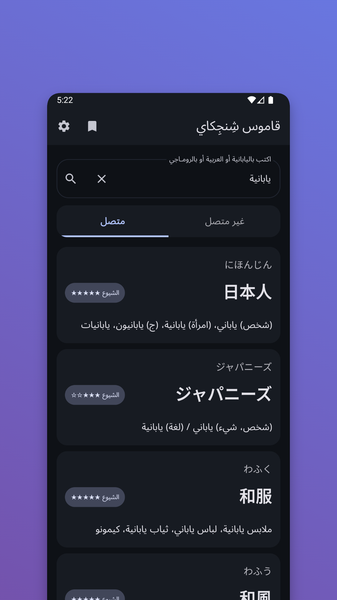
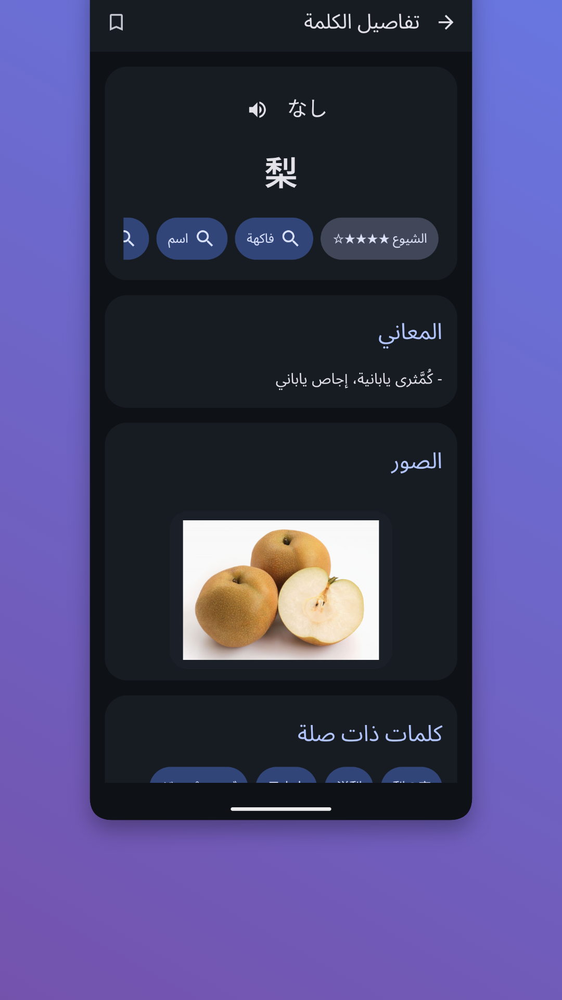

# قاموس شينجيكاي للأندرويد

[English](./README.md) | [العربية](./README.ar.md)

تطبيق أندرويد مبني باستخدام Kotlin وJetpack Compose للبحث في قاموس ياباني إلى عربي عبر واجهة Shinjikai البرمجية:  
`https://shinjikai.app`

## إخلاء مسؤولية

ℹ️ هذا التطبيق مشروع مستقل من صنع المعجبين، وليس تابعًا رسميًا لـ **Shinjikai**.  
وهو مبني باستخدام واجهة API الخاصة بموقع [shinjikai.app](https://shinjikai.app)، وجميع حقوق بيانات القاموس والجهد المبذول فيها تعود إلى القائم على موقع **Shinjikai**.

## ✨ المميزات

- 🔎 بحث سريع عن الكلمات باليابانية والعربية
- 🧾 شاشة تفاصيل للكلمة تتضمن:
  - الكانا والكانجي
  - مستوى JLPT
  - تصنيفات على شكل شرائح
  - تعريفات باللغة العربية
  - قسم كلمات مرتبطة مثل المرادفات والأضداد والروابط ذات الصلة عند توفرها
- 🔖 الإشارات المرجعية لحفظ الكلمات وإدارتها
- 🕘 سجل آخر عمليات البحث
- 🌐 وضع الاتصال المباشر عبر واجهة Shinjikai RPC
- 📦 وضع عدم الاتصال مع استيراد قاموس Yomitan محلي
- 🎨 واجهة Material 3 مع دعم المظهر الفاتح والداكن

## 📱 لقطات الشاشة

  
  

## 🧠 واجهات API المستخدمة

- `POST /rpc/SearchWords`
- `POST /rpc/LoadWordDetails`
- `POST /rpc/LoadCategories`

تتضمن ترويسات الطلب قيمة `X-Client-Id` كما يتطلبها الخادم.

## 🛠️ التقنيات المستخدمة

- Kotlin
- Jetpack Compose (Material 3)
- Retrofit + OkHttp + Gson
- Room لقاعدة البيانات المحلية الخاصة بالقاموس دون اتصال والإشارات المرجعية
- Coroutines

## ▶️ تشغيل التطبيق

1. افتح هذا المجلد في Android Studio.
2. انتظر حتى يكتمل Gradle Sync.
3. شغّل إعداد `app` على محاكي أو جهاز أندرويد.

## ⚙️ ملاحظات

- البحث يستخدم حالياً وضع API الافتراضي (`Mode = 0`).
- بعض الحقول مثل الروابط ذات الصلة أو التصنيفات تعتمد على توفر البيانات من الـ API لكل كلمة.
- في وضع عدم الاتصال، تأتي البيانات من القاموس المحلي المستورد وقد تختلف عن تفاصيل الوضع المتصل.

## 🗂️ هيكل المشروع

- `app/src/main/java/com/shinjikai/dictionary/` -> الواجهة وتدفق التطبيق
- `app/src/main/java/com/shinjikai/dictionary/data/` -> نماذج الـ API والمستودع وRoom ومصدر البيانات دون اتصال
- `app/src/main/res/` -> الموارد مثل النصوص والثيمات والأيقونات والخطوط

## 🙌 الشكر

- بيانات القاموس وواجهة API: **Shinjikai** (`https://shinjikai.app`)
- رابط الأرشيف الافتراضي لمصدر البيانات دون اتصال يشير إلى مجموعة بيانات `a-hamdi/japanesearabic` التي يستخدمها مستورد التطبيق.
