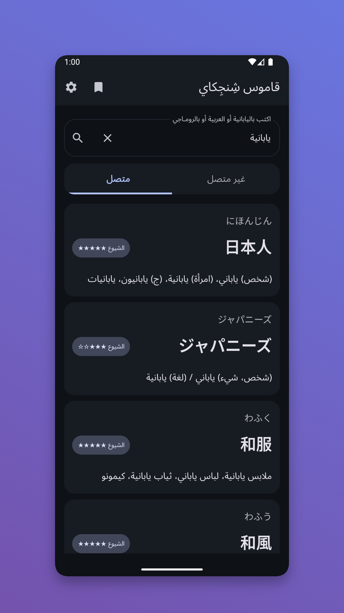
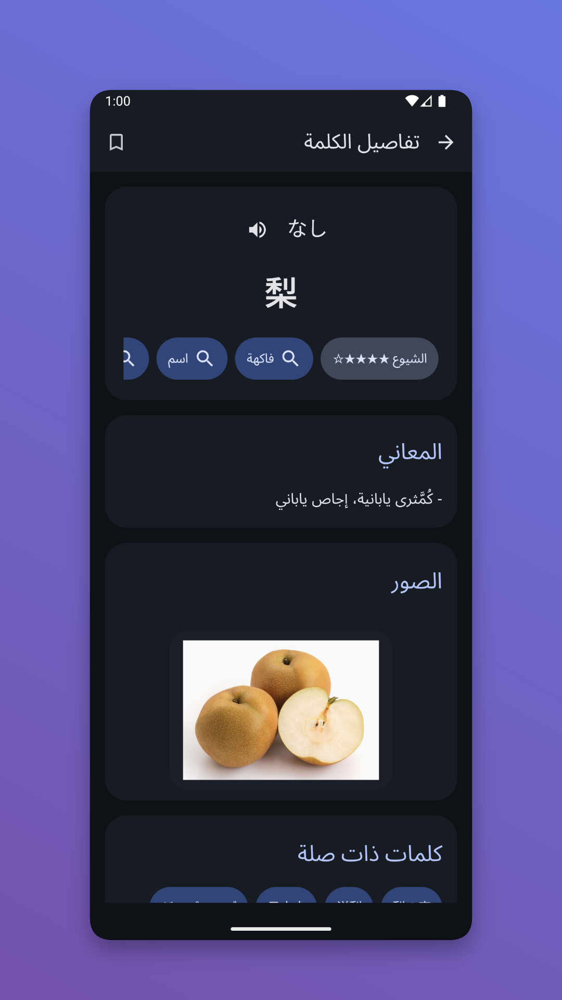

# Shinjikai Android Dictionary

[English](./README.md) | [العربية](./README.ar.md)

Android app (Kotlin + Jetpack Compose) for Japanese to Arabic dictionary lookup using the Shinjikai API:  
`https://shinjikai.app`

## 📱 Screenshots

<p align="center">
  
  
</p>


## ℹ️ Disclaimer

This app is an independent project and is not officially affiliated with Shinjikai.  
It uses the API provided by [shinjikai.app](https://shinjikai.app), and full credit for the dictionary data and its development goes to the Shinjikai website maintainers.

## ✨ Features

- 🔎 Fast word search (Japanese and Arabic queries)
- 🧾 Detailed word screen with:
  - kana + kanji
  - JLPT level
  - category chips
  - Arabic definitions
  - related words section (synonyms, antonyms, and related links when available)
- 🔖 Bookmarks (save and manage words)
- 🕘 Recent searches
- 🌐 Online mode (Shinjikai RPC API)
- 📦 Offline mode with local Yomitan dictionary import
- 🎨 Material 3 UI with dark/light theme support

## 🧠 API Endpoints Used

- `POST /rpc/SearchWords`
- `POST /rpc/LoadWordDetails`
- `POST /rpc/LoadCategories`

Request headers include `X-Client-Id` as required by the backend.

## 🛠️ Tech Stack

- Kotlin
- Jetpack Compose (Material 3)
- Retrofit + OkHttp + Gson
- Room (local database for offline dictionary + bookmarks)
- Coroutines

## ▶️ Run the App

1. Open this folder in Android Studio.
2. Let Gradle sync.
3. Run the `app` configuration on an emulator or Android device.

## ⚙️ Notes

- Search runs locally against the bundled/imported Room FTS dictionary.
- Some fields, such as related links and categories, depend on bundled data availability per word.
- If no bundled assets are present, import a supported dictionary archive from the local dictionary settings screen.

## 🗂️ Project Structure

- `app/src/main/java/com/shinjikai/dictionary/` -> UI and app flow
- `app/src/main/java/com/shinjikai/dictionary/data/` -> API models, repository, bundled importer, Room, and offline source
- `app/src/main/res/` -> resources (strings, themes, icons, fonts)

## 🙌 Credits

- Dictionary data: **1Selxo/Shinjikai** (`https://github.com/1Selxo/Shinjikai`)
- Japanese deinflection transforms: **Yomitan** (`https://github.com/yomidevs/yomitan/tree/master/ext/js/language/ja`), GPL-3.0-or-later.
- The default offline source archive URL points to the `a-hamdi/japanesearabic` dataset used by the app importer.

## Bundled Dictionary Assets

The app ships the `1Selxo/Shinjikai` dictionary locally instead of using the Shinjikai API. Run:

```powershell
.\scripts\fetch-bundled-dictionary.ps1
```

The script downloads `1Selxo/Shinjikai`, writes the data into `app/src/main/assets/bundled_dictionary/`, compresses `data_*.jsonl` as `.jsonl.xz`, recompresses images when it can make them smaller, and stores images as git-safe chunked `tar.xz` assets. On first launch the app imports the bundled JSONL into Room/FTS, extracts the bundled images into app storage, then all lookups run locally against SQLite indexes.
